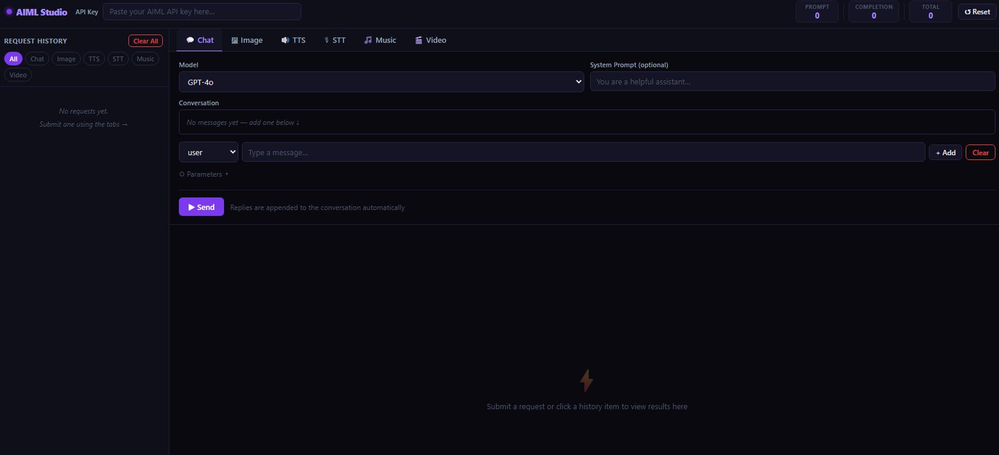

# AIML API Studio

> [!TIP]
> This tool is actively maintained as a private utility for the AIML API. Feature requests and bug reports are welcome via GitHub Issues and will be reviewed within 1–3 weeks.

> [!WARNING]
> ⚠️ CAUTION: This repository contains code developed with the assistance of Artificial Intelligence (AI). While functional, AI-generated code can introduce hidden bugs, security vulnerabilities, or logic flaws that may not be immediately apparent. Please thoroughly review, audit, and test all files in an isolated development environment before deployment, as this software is provided as-is and used entirely at your own risk.

## 🚀 Introduction

AIML API Studio is a browser-based web interface for the [AIML API](https://docs.aimlapi.com/) built as a single self-contained HTML file — no server, no login, no activity logging, no backend. It runs entirely in the browser with no external dependencies and stores nothing — not even your API key.

The interface is built around a clean tabbed layout covering every major AIML API request type: chat and text generation, image generation, text-to-speech, speech-to-text transcription, AI music generation, and video generation. A persistent sidebar logs every request made during the session, with live status indicators and a 15-second polling loop that automatically resolves asynchronous queue jobs. Generated images, audio, and video render directly inside the interface — no downloading required to preview results.

It is intended as a compact, focused tool for experimenting with AI model APIs — from quick chat completions and image prompts to full music tracks and generated video clips — entirely within the browser, with no account, no tracking, and no friction.

---

## 🔥 Features

A comprehensive feature set covering all major AIML API endpoint categories with a polished, production-ready interface.

### 🔑 API Key & Privacy

The API key is entered once per session into a password field in the header bar. It is never stored, never transmitted anywhere other than directly to `api.aimlapi.com`, and disappears when the tab is closed. No cookies, no `localStorage`, no telemetry of any kind. The interface is fully offline-capable — load the file once, disconnect from the internet, and it still runs (API calls naturally require connectivity).

### 💬 Chat & Text Generation

Full multi-turn conversation interface with support for system prompts, per-message role assignment (user / assistant), and dynamic message history that persists across requests in the same session. Assistant replies are automatically appended to the conversation for natural back-and-forth. Supports **15+ models** across all major providers available through AIML API:

| Provider | Models |
|---|---|
| OpenAI | GPT-4o, GPT-4o Mini, GPT-4 Turbo, GPT-3.5 Turbo |
| Anthropic | Claude 3.5 Sonnet, Claude 3 Opus, Claude 3 Haiku |
| Meta | Llama 3.3 70B, Llama 3.1 405B / 70B / 8B Turbo |
| Mistral AI | Mistral Large, Mixtral 8x22B, Mistral 7B |
| DeepSeek | DeepSeek V3, DeepSeek R1 |
| Qwen / Alibaba | Qwen 2.5 72B / 7B, QwQ 32B |
| Google | Gemma 2 27B / 9B |

Advanced parameters are available via a collapsible panel: max tokens, temperature, top-p, frequency penalty, presence penalty, and stop sequences.

### 🖼️ Image Generation

Prompt-based image generation with support for both synchronous (DALL·E) and asynchronous (Flux, Stable Diffusion) models. The interface automatically detects whether a response contains an immediate result or an async task ID, routing it to the queue poller transparently. Generated images render in an inline responsive grid. Clicking any image opens a full-screen lightbox viewer.

| Model Group | Models |
|---|---|
| OpenAI (sync) | DALL·E 3, DALL·E 2 |
| Flux / Black Forest Labs | Flux Dev, Flux Schnell, FLUX.1 Schnell, FLUX.1 Dev |
| Stability AI | Stable Diffusion XL, SD3 Medium, SD3.5 Large |

Advanced parameters include image count, quality, style (DALL·E 3), negative prompt, inference steps, CFG guidance scale, and seed.

### 🔊 Text-to-Speech (TTS)

Converts text input to audio using OpenAI-compatible TTS endpoints. Supports both `tts-1` (fast) and `tts-1-hd` (high quality) models with all six available voices (Alloy, Echo, Fable, Onyx, Nova, Shimmer). Speed is adjustable via a slider from 0.25× to 4×. Output format is selectable (MP3, Opus, AAC, FLAC, WAV). Generated audio plays back via an inline HTML5 audio player and can be downloaded in one click.

### 🎙️ Speech-to-Text (STT)

Audio transcription powered by Whisper-1. Accepts audio files via click-to-browse or drag-and-drop. Supports MP3, MP4, WAV, M4A, WebM, FLAC, and OGG formats. Language can be specified via ISO 639-1 code for improved accuracy. An optional context hint field accepts spelling hints or domain-specific terms. Response format is selectable: plain JSON, plain text, verbose JSON with word-level timestamps, SRT subtitles, or VTT subtitles. SRT and VTT outputs include a one-click download button.

### 🎵 Music Generation

AI music generation via Suno models. Supports custom lyrics, genre tag fields, song title, and an instrumental toggle. The prompt field accepts free-form music descriptions. Music generation is always asynchronous — the request registers a queued job that is polled automatically every 15 seconds. When complete, each track renders with cover art, an inline audio player, a download button, and an expandable lyrics panel. Supports Suno v3.5, Suno v4, and Chirp v3.0 / v3.5.

### 🎬 Video Generation

Text-to-video and image-to-video generation across multiple model providers. An optional starting image URL field enables image-conditioned generation for supported models. Aspect ratio and duration are configurable. Video generation is always asynchronous and handled by the queue system. Completed videos render in an inline HTML5 video player with a download button.

| Model | Provider |
|---|---|
| Runway Gen-3 Turbo | Runway ML |
| MiniMax Video-01 | MiniMax |
| Luma Dream Machine | Luma AI |
| Kling v1 Standard / v1.5 Pro | Kling |
| Wan Pro T2V-14B | Wan |
| Stable Video Diffusion | Stability AI |

### 📋 Request History Sidebar

Every request submitted during a session is logged to a persistent sidebar on the left side of the interface. Each entry shows the request type badge, model name, a preview of the prompt, timestamp, token count (where applicable), and a color-coded status indicator:

| Status | Indicator |
|---|---|
| Pending | Grey dot |
| Queued (async) | Amber pulsing dot |
| Complete | Green dot |
| Error | Red dot |

Filter buttons at the top of the sidebar allow narrowing the history to a specific request type. Clicking any history entry re-renders its result in the main panel. The full history can be cleared with a single button.

### ⏳ Async Queue System

Requests that return a task ID rather than an immediate result (music, video, some image models) are automatically registered in a queue. A live countdown in the sidebar footer ticks down second-by-second and triggers a poll of all pending jobs every 15 seconds. Each job type uses the appropriate status endpoint. Completed jobs update the sidebar and response panel in place and trigger a toast notification. Jobs that fail during polling are marked as errored with the API error message shown.

### 📊 Token Usage Tracking

A live token counter in the header bar tracks cumulative prompt tokens, completion tokens, and total tokens consumed across all chat requests made during the session. The counter updates after every successful chat completion using the `usage` field from the API response. A reset button clears all counts. Token tracking applies only to text generation endpoints; image, audio, and video endpoints do not report token counts.

### 📺 Inline Media Display

All generated media renders directly inside the interface without requiring any external viewer or download:

- **Images** — responsive CSS grid, click to open in fullscreen lightbox (press Escape or click outside to close)
- **Audio** (TTS / Music) — native HTML5 `<audio>` element with browser-default controls
- **Video** — native HTML5 `<video>` element, max height constrained for readability
- **Text** — pre-wrapped output with monospace formatting preserved for subtitles and structured output
- **Raw JSON** — collapsible section on every response card showing the unmodified API response

---

## 🗒️ Requirements

No server-side requirements. The interface runs entirely in the browser.

| Requirement | Value |
|---|---|
| Modern Browser (Chrome, Firefox, Edge, Safari) | Required |
| JavaScript enabled | Required |
| Internet connection | Required for API calls only |
| AIML API key | Required — obtain at [aimlapi.com](https://aimlapi.com/) |
| Screen resolution | 1280×720 minimum recommended |

---

## 🛠️ Usage

### 📄 Local File

Download `index.html` from this repository and open it directly in your browser. Everything is self-contained in that single file — no CDN, no network requests, no build step.

### 🌐 GitHub Pages

The interface is also hosted via GitHub Pages directly from this repository. No installation required — open the link in any modern browser:

[https://bugfishtm.github.io/simple-aiml-api-interface/](https://bugfishtm.github.io/simple-aiml-api-interface/)

### 🔑 Getting an API Key

An AIML API key is required to use this tool. Keys can be obtained at [aimlapi.com](https://aimlapi.com/). Paste your key into the **API Key** field in the top header bar. The key is used only for direct requests to `api.aimlapi.com` and is never stored anywhere.

---

## 📁 Repository Structure

| Path | Description |
|---|---|
| .git/ | Internal file, can be ignored. |
| .github/ | Internal file, can be ignored. |
| index.html | The complete AIML API Studio — single self-contained HTML file. |
| [README.md](README.md) | This readme file. |
| [LICENSE.md](LICENSE.md) | License file. |

---

## 💬 Support Channels

If you encounter any issues or have questions while using this software, feel free to contact us:

- **GitHub Issues** is the main platform for reporting bugs, asking questions, or submitting feature requests: [https://github.com/bugfishtm/simple-aiml-api-interface/issues](https://github.com/bugfishtm/simple-aiml-api-interface/issues)
- **Discord Community** is available for live discussions, support, and connecting with other users: [Join us on Discord](https://discord.com/invite/xCj7AEMmye)
- **Email support** is recommended only for urgent security-related issues: [security@bugfish.eu](mailto:security@bugfish.eu)

---

## 📢 Spread the Word

Help us grow by sharing this project with others! You can:

* **Tweet about it** – Share your thoughts on [Twitter/X](https://twitter.com) and link us!
* **Post on LinkedIn** – Let your professional network know about this project on [LinkedIn](https://www.linkedin.com).
* **Share on Reddit** – Talk about it in relevant subreddits like [r/artificial](https://www.reddit.com/r/artificial/) or [r/opensource](https://www.reddit.com/r/opensource/).
* **Tell Your Community** – Spread the word in Discord servers, Slack groups, and forums.

---

## 🌱 Contributing to the Project

Thank you for your interest in this project.

At this time, this repository is **not open for external contributions**.
Please do **not** submit pull requests or patches.

- Pull requests from external contributors are not accepted.
- Any unsolicited pull requests will be closed without review.
- All code in this repository is maintained by the project owner.
- By design, no third‑party code will be merged into this project via GitHub.

If you encounter a bug or have an enhancement suggestion, please check the "Issues" section of our GitHub repository or visit our official website for guidance before beginning any work on it.

---

## 🤝 Community Guidelines

We're focused on developing innovative solutions and advancing technology. By being part of this, you contribute to our progress.

Positive guidelines include being kind, empathetic, and respectful in all interactions. It is important to engage thoughtfully and offer constructive, solution-oriented feedback. Fostering an environment of collaboration, support, and mutual respect is essential.

Unacceptable behaviors include harassment, hate speech, or offensive language. Personal attacks, discrimination, or any form of bullying are not tolerated. Sharing private or sensitive information without explicit consent is strictly prohibited.

Together, we can partner to achieve common goals by following guidelines designed to promote effective collaboration and positive teamwork.

---

## 🛡️ Security Policy

I take security seriously and appreciate responsible disclosure. If you discover a vulnerability, please follow these steps:

- **Do not** report it via public GitHub issues or discussions. Instead, please contact the [security@bugfish.eu](mailto:security@bugfish.eu) email address directly.
- Provide as much detail as possible, including a description of the issue, steps to reproduce it, and its potential impact.

I aim to acknowledge reports within **2–4 weeks** and will update you on our progress once the issue is verified and addressed.

This software is provided as-is, without any guarantees of security, reliability, or fitness for any particular purpose. We do not take responsibility for any damage, data loss, security breaches, or other issues that may arise from using this software. By using this software, you agree that We are not liable for any direct, indirect, incidental, or consequential damages. Use it at your own risk.

---

## 📜 License Information

The license for this software can be found in the [LICENSE.md](LICENSE.md) file. The software may also include additional licensed software or libraries.

🐟 Bugfish